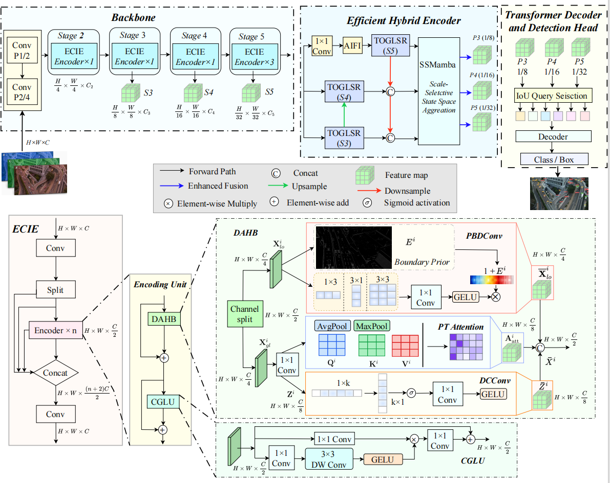
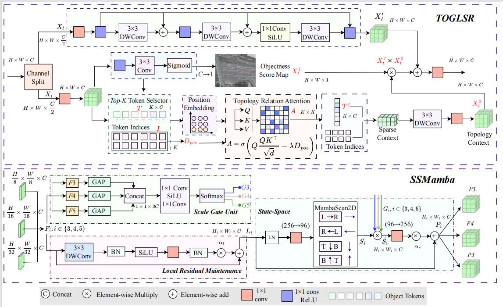

# ML-DETR

> **ML-DETR: Multi-level Structure-aware Feature Reorganization for Real-time Remote Sensing Detection Transforms**

## Overview

Remote sensing images pose inherent challenges, including small object sizes, dense object distributions, complex backgrounds, and large-scale variations, which often cause significant performance degradation when general-purpose detectors are directly transferred to remote sensing scenarios. To address these issues, this paper proposes ML-DETR, a multi-level structure-aware real-time object detection framework for remote sensing images. ML-DETR systematically reorganizes object representations by collaboratively optimizing the entire feature flow across three key stages. In the feature extraction stage, an Efficient Context Information Enhancement (ECIE) module actively preserves small-object structural information through boundary priors, global correlations, and directional context modeling, thereby alleviating feature degradation at the source. In the spatial response modeling stage, a Topology-Guided Global-Local Spatial Recalibration (TOGLSR) module selects sparse candidate tokens based on objectness scores and enhances target-region responses through position-constrained topological relation attention while reducing background interference. In the cross-scale fusion stage, a Scale-Selective State Space Aggregation (SSMamba) module calibrates the consistency of multi-scale features by leveraging the linear state modeling capability of Mamba, providing more stable input representations for the decoder. Extensive experiments on VisDrone, AI-TOD, and DOTA demonstrate that ML-DETR achieves competitive detection performance among representative real-time and transformer-based detectors under the evaluated settings.

## Framework

<p align="center">
  
</p>

<p align="center"><b>Figure 1. Overall architecture of ML-DETR with ECIE.</b></p>

<p align="center">
  
</p>

<p align="center"><b>Figure 2. TOGLSR and SSMamba modules.</b></p>

## Code Release

This repository contains the source code required to train, evaluate, and analyze ML-DETR, including:

- Training script
- Evaluation script
- Model architecture
- Model configuration files
- ML-DETR related modules
- Inference latency benchmark
- Heatmap visualization tool

## Repository Structure

The main implementation is organized as follows:

```text
ML-DETR/
|-- assets/
|   |-- ml-detr-ecie.png
|   `-- toglsr-ssmamba.png
|-- dataset/
|   `-- data.yaml
|-- tools/
|   |-- benchmark_latency.py
|   `-- visualize_heatmap.py
|-- ultralytics/
|   |-- cfg/models/ml-detr/ml-detr.yaml
|   |-- cfg/models/rt-detr/
|   |-- models/rtdetr/
|   `-- nn/modules/block.py
|-- train.py
|-- test.py
|-- requirements.txt
`-- README.md
```

## Environment Setup

Install the required packages:

```bash
pip install -r requirements.txt
pip install -e .
```

`requirements.txt` includes `mamba-ssm` and `causal-conv1d` because `ml-detr.yaml` uses the `SSMamba` module.

Please install PyTorch according to your CUDA version before training or evaluation.

## Dataset Preparation

Prepare the dataset in YOLO detection format and edit:

```text
dataset/data.yaml
```

Example:

```yaml
path: /path/to/dataset
train: images/train
val: images/val
test: images/test

names:
  0: class_0
  1: class_1
```

## Training

Train ML-DETR with:

```bash
python train.py --data dataset/data.yaml --model ultralytics/cfg/models/ml-detr/ml-detr.yaml
```

Common options:

```bash
python train.py --data path/to/data.yaml --epochs 150 --batch 8 --device 0 --name ml-detr
```

## Evaluation

Evaluate a trained best.pt:

```bash
python test.py --weights path/to/best.pt --data dataset/data.yaml --split test --device 0
```

## Notes

This repository is prepared for academic research and reproducibility. Citation information will be updated after the manuscript is officially available.
